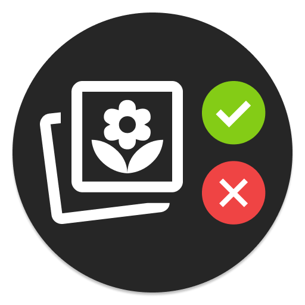

<p align="center">
  
  <h1 align="center">Riffle</h1>
  <p align="center">
    A photo culling tool for reviewing and organizing photos before importing to your photo library.
  </p>
</p>

### Overview

Riffle handles the curation stage between camera and photo library. Import photos, review and rate them, then export selected photos to Immich, PhotoPrism, Google Photos, iCloud Photos, or other photo management software.

### Workflow

```
Import → Curate → Library → Export
```

**Import**
* Exact duplicate detection using SHA256 hashing
* Smart candidate selection based on EXIF metadata
* Organizes photos by date into `YYYY/MM - MonthName/` folders
* Pre-generates thumbnails for fast gallery loading
* Preserves EXIF metadata and file timestamps
* Supports HEIC, HEIF, MOV, MP4, and common image formats

**Library**
* Browse organized photos in masonry grid layout
* Burst detection for rapid-fire sequences (configurable)
* Photo metadata display (camera, settings, GPS)
* Image lightbox with full-screen view
* Video playback support

**Curate** (Photo Culling Interface)
* Fast keyboard-driven review (P/X/U/1-5)
* Accept, reject, unflag, or rate photos quickly
* Full-screen lightbox curation with auto-advance
* Visual progress tracking
* Undo with fade-out animations

**Trash** (Virtual Safety Net)
* Review rejected photos before final deletion
* No immediate file deletion
* Easy recovery of mistakenly rejected photos

**Calendar**
* Month-by-month grid
* Cover photos for each month

**Albums**
* Organize photos into custom collections
* Add/remove photos from multiple albums

**Stats**
* Analytics dashboard showing photo collection statistics over time
* Stacked bar charts grouped by decade
* Breakdown by curated, uncurated, and trashed photos

**Settings**
* Import configuration (folder path, move/copy mode, history)
* Library management (folder paths, storage stats, rebuild thumbnails)
* Burst detection (enable/disable, time window, similarity threshold, rebuild)
* Export configuration (folder path, organization, deduplication, cleanup)

**Export**
* Filter photos by minimum rating (0-5) and curation status
* Configurable folder organization (maintain structure or flatten)
* Duplicate handling options (skip or include)
* Optional cleanup (delete from library after export)
* Session tracking with per-photo export status logging
* Preserves original file timestamps
* Export to folder for import into other photo management software

### Docker

```yaml
services:
  riffle:
    image: ghcr.io/sheshbabu/riffle/riffle:latest
    ports:
      - "8080:8080"
    volumes:
      - ./data:/data
      - ./import:/import
      - ./library:/library
      - ./thumbnails:/thumbnails
      - ./export:/export
    restart: unless-stopped
```

### Installation

Install system dependencies:
```bash
# macOS
brew install exiftool ffmpeg libheif vips

# Linux
apt-get install libimage-exiftool-perl ffmpeg libheif-dev libvips-dev
```

Build from source:
```bash
$ make build
```

### Configuration

Create `.env` file in the project root:
```bash
cp .env.example .env
```

Edit `.env` and set your folder paths:
```
IMPORT_PATH=/path/to/import/folder
LIBRARY_PATH=/path/to/library
THUMBNAILS_PATH=/path/to/thumbnails
EXPORT_PATH=/path/to/export
```

### Usage

Start the server:
```bash
$ ./riffle
```

Open your browser to `http://localhost:8080`

### Development

Run development server with auto-reload:
```bash
$ make watch
```

Or run once:
```bash
$ make dev
```

### Reverse Geocoding

This project uses offline reverse geocoding with data from [GeoNames](http://download.geonames.org/export/dump/). Location data is stored locally for fast lookups without network requests.

Note that cities1000 dataset includes places with population > 1000, providing city-level accuracy.

### Vendor Dependencies

Download React:
```bash
curl -L -o assets/react.production.min.js https://cdn.jsdelivr.net/npm/react@18.3.1/umd/react.production.min.js
curl -L -o assets/react-dom.production.min.js https://cdn.jsdelivr.net/npm/react-dom@18.3.1/umd/react-dom.production.min.js
```

### Thanks
* [go-exiftool](https://github.com/barasher/go-exiftool) - EXIF metadata extraction
* [go-sqlite3](https://github.com/mattn/go-sqlite3) - SQLite database driver
* [goimagehash](https://github.com/corona10/goimagehash) - Perceptual image hashing
* [goheif](https://github.com/adrium/goheif) - HEIC/HEIF format support
* [bimg](https://github.com/h2non/bimg) - Fast image processing with libvips
* [golang.org/x/image](https://pkg.go.dev/golang.org/x/image) - Extended image format support
